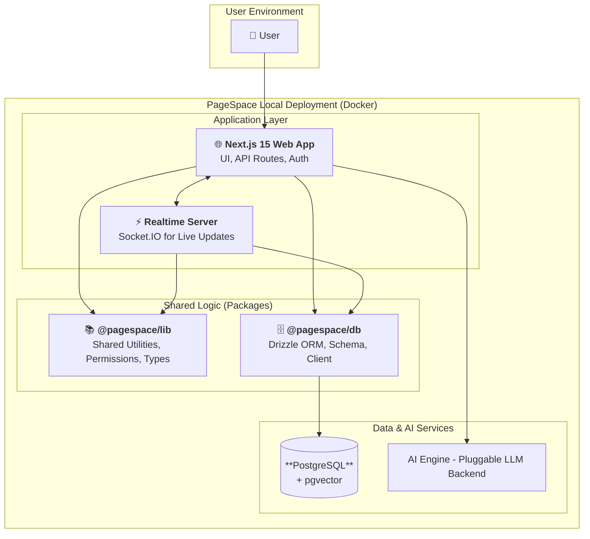
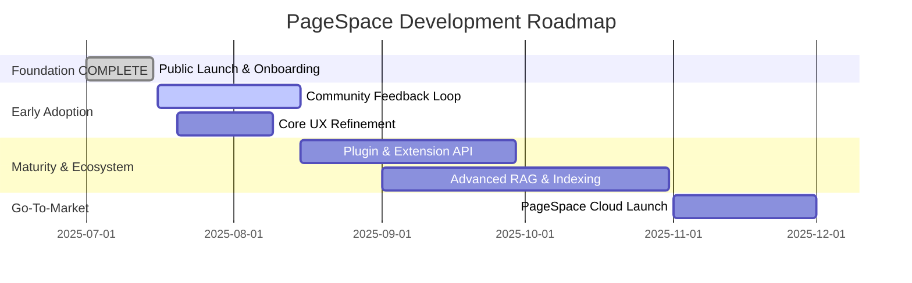

# PageSpace: Your Private, AI-Powered Knowledge Engine
> **Currently in early development — this is a scaffold, not a finished product.**  
> We're building a local-first, AI-native knowledge base that transforms scattered files into institutional memory. Join us early, help shape the future.
---

PageSpace is an AI-native knowledge base that transforms your scattered documents, conversations, and project files into a single, intelligent, and perpetually searchable engine.

It's built for teams who believe **context is their most valuable asset**—and that **data control is non-negotiable**.

**Our philosophy is simple: your knowledge should be a memory you can build, not a black box you can't control.**

[](LICENSE)
[](https://github.com/pagespace-network/pagespace.team/stargazers)
[](https://discord.gg/yxDQkTHXT5)

---

## Why PageSpace: Context as Architecture

PageSpace isn't just a knowledge base — it's a philosophy:  
**Your institutional memory should be contextual, structured, and fully in your control.**

We believe:

- 🧠 **Context is memory.** A note inside a folder means something different than a note alone. PageSpace models this explicitly: everything lives in a structured, position-aware tree.
- 🗂️ **Structure encodes meaning.** Hierarchy isn’t just organization — it drives permissions, relevance, and even how AI behaves. Moving a page is a semantic act.
- 📄 **Pages are the universal primitive.** Documents, folders, chats, databases, and AI live inside a single recursive model. You can nest anything inside anything — and AI can reason across it all.

These core ideas make PageSpace ideal for many types of builders:

| For the **Open Source Developer** | For the **Founder & Business** | For the **AI Researcher** |
| :--- | :--- | :--- |
| 👩‍💻 **Build What You Need.** Our mindset is "scratch your own itch." PageSpace is a framework for solving your own workflow problems. | 🏢 **Own Your Data.** Deploy on your own hardware, even air-gapped. Your knowledge is never a liability. | 🔬 **A Unique Research Sandbox.** Study retrieval, context, and user interaction on a real-world, local-first AI stack. |
| 🔧 **A Modern, Hackable Stack.** Built with Next.js 15, TypeScript, and Docker. No legacy code, just clean patterns. | 🧠 **Create Institutional Memory.** Stop losing context when team members leave. Build a knowledge base that grows with you. | 🧪 **Experiment-Ready Codebase.** Customize retrieval, memory, and evaluation logic for practical research workflows. |
| 🚀 **From Contributor to Partner.** We offer a path from PR to partnership for solutions that solve real market needs. | 💰 **Clear ROI.** Reduce research time, accelerate onboarding, and make better decisions with all your context in one place. | 📈 **Real-World Data.** Analyze how teams build and interact with a hierarchical, contextual knowledge graph. |ter decisions with all your context in one place. | 📈 **Real-World Data.** Analyze how teams build and interact with a hierarchical, contextual knowledge graph. |

## Early Preview Screenshot


---

## Key Features: The Building Blocks of Your Knowledge Engine

PageSpace is built on a set of powerful, interconnected features that bring your knowledge to life.

#### 🧠 Contextual AI Chat
- **Page AI:** Lives inside your documents, inheriting their context and permissions for deep, focused conversations.
- **Assistant AI:** Roams across your entire knowledge base for broad, cross-project inquiries.
- **Multi-Document Analysis:** Chat with multiple documents at once to compare, contrast, and synthesize information.

#### 📁 Universal Content System
- **Nest Anything:** PDFs inside project folders, AI chats inside documents, emails inside client briefs. It's a fully recursive system.
- **@Mention Anything:** Use @mentions to link any kind of page, insert context, or create semantic maps of your data.
- **Cross-Format Intelligence:** The AI understands the relationships between different file types, turning them into unified context.

#### 🔒 Local-First Security & Control
- **On-Premises Deployment:** Run PageSpace on your own servers with Docker. Complete data sovereignty.
- **Air-Gapped Capability:** Operate in secure environments without sacrificing AI capabilities.
- **Granular Permissions:** Role-based access control that inherits through the document hierarchy.

---

## 🏛️ Architecture: Built for Control and Scale

PageSpace uses a modern, transparent, and scalable architecture designed for local-first operation and easy extension.



- **Frontend:** Next.js 15 (App Router), TypeScript, Tailwind CSS, shadcn/ui, Tiptap
- **Backend:** Next.js API Routes, Socket.io Realtime Server
- **Database:** PostgreSQL via Drizzle ORM
- **AI:** AI models orchestrated by the Vercel AI SDK
- **Deployment:** A simple `docker-compose up` for a full local stack.

---

## 🚀 Get Started in 5 Minutes

**Prerequisites:** Node.js (v20+), pnpm, Docker

1.  **Clone the repo:**
    ```bash
    git clone https://github.com/pagespace-network/pagespace.team.git
    cd pagespace.team
    ```
2.  **Install dependencies:**
    ```bash
    pnpm install
    ```
3.  **Set up environment variables:**
    Copy `.env.example` to `.env` in the project root and `apps/web/.env.example` to `apps/web/.env`. Generate a secure `ENCRYPTION_KEY` for the root `.env` file.
    ```bash
    cp .env.example .env
    cp apps/web/.env.example apps/web/.env
    # Generate a strong ENCRYPTION_KEY for .env (e.g., using `openssl rand -base64 32`)
    ```
4.  **Launch the environment:**
    ```bash
    docker-compose up -d
    ```

Your pagespace instance is now running:
- **Web App:** `http://localhost:3000`
- **Realtime Server:** `http://localhost:3001`

---

## 🤝 Contributing: Build the Tool You Wish You Had

PageSpace is built on a simple idea: **the best features come from solving real problems.** We are open-sourcing it pre-MVP because we want to build a community of developers who use it, break it, and shape it to solve their own unique challenges.

1.  **Find Your Itch:** What's the most frustrating part of your workflow?
2.  **Build Your Solution:** Use the PageSpace framework to solve it.
3.  **Share with the Community:** Submit a PR and help everyone who shares your problem.

## Project Status

This project is currently in its **foundation phase** — a minimal but extensible scaffold designed to support powerful knowledge tools. The core architecture is now in place, including:

- A hierarchical page system and layout framework
- Role-based access control (RBAC) and permission tree
- Context-aware AI chat as a base interaction layer

From here, upcoming functionality will be built **directly on top of this foundation**:

- **Retrieval-Augmented Generation (RAG)** — including lexical and vector search — will respect the existing permission model to deliver secure, scoped results.
- **AI Artifacts and Snippets** will expand the AI layer with persistent, reusable outputs tied to documents, tags, and users.
- **Any File Type Uploads** will add convenience and depth to the system by enabling automatic parsing, embedding, and intelligent display of diverse content formats like PDFs, spreadsheets, emails, and images.

We’re optimizing for long-term adaptability rather than short-term feature completeness. This phase is about getting the scaffolding right so future capabilities fit naturally into place.

## 🗺️ Visual Roadmap: Where We're Going

We believe in building in public. Our roadmap is not just a list of features — it's a reflection of our priorities and philosophy.



## Community & Support

- **[GitHub Discussions](https://github.com/2witstudios/pagespace.team/discussions):** Ask questions and share ideas.
- **[GitHub Issues](https://github.com/2witstudios/pagespace.team/issues):** Report bugs and request features.
- **[Documentation](./docs/1.0-overview/1.1-table-of-contents.md):** Dive deep into the architecture and guides.

---

**pagespace is dogfooded all the way down.** Our documentation, roadmap, and contribution workflow all live within pagespace itself. We're not just building a product; we're building the environment we've always wanted to work in.

**Join us.**
