# PageSpace: The AI-First Workspace for Building Knowledge, Together

> 🧪 **Currently in early development — this is a scaffold, not a finished product.**  
> PageSpace is a local-first, AI-native workspace where you compose, remix, and automate your team’s thinking. Join us early and help shape the future of creative knowledge work.

---

PageSpace is your modular workspace for working with context — not just information.  
Instead of stitching together Slack for messaging, Notion for notes, and Google Drive for files, PageSpace gives you one AI-powered environment where **you, your team, and your tools all collaborate on the same canvas**.

Built for those who treat **work as creative structure**, not scattered files — and who believe that **AI should enhance, not obscure, your process**.

**Our philosophy is simple:** your work should be a memory you can shape, navigate, and reuse — not a silo you forget.

[](LICENSE)
[](https://github.com/2witstudios/pagespace.team/stargazers)
[](https://discord.gg/yxDQkTHXT5)

---

## 🧱 Core Model: A Composable Workspace for Thinking in Context

PageSpace isn’t just a knowledge base — it’s a structured thinking environment, where **documents, conversations, and AI share the same shape**.

We believe:

- 🧠 **Context is the creative layer.** Meaning emerges from structure. A note in a folder is different than a note alone — and PageSpace treats that as real data.
- 🗂️ **Structure encodes logic.** Move a page, change the meaning. Our AI respects hierarchy, tags, and position — and answers differently based on what’s near what.
- 📄 **Everything is a Page.** Docs, chats, spreadsheets, task lists, AIs — all nestable, linked, and permissioned. You don’t move between tools; the tools move with you.

---

## 🔥 Who It's For

| For the **Open Source Hacker** | For the **Productive Team** | For the **AI Researcher** |
| :--- | :--- | :--- |
| 🧩 **Remix Your Workflow.** Use PageSpace like a programmable interface — and ship workflows that live inside your repo. | 💼 **Work Like a Team, Not a Toolset.** No more Notion + Slack + Drive + AI — one workspace, one context model. | 🔬 **Think With Context.** Study real-world, hierarchical, permissioned retrieval with traceable output. |
| 🧠 **AI That Respects You.** It talks like a teammate, not a chatbot. Scoped, embedded, and structured by context. | 🛠 **On-Prem, If You Need It.** Run air-gapped, containerized, or hybrid. Your infrastructure, your rules. | 🧪 **Instrument Everything.** Perfect for building, evaluating, or experimenting with local-first AI loops. |
| 🪄 **From PR to Plugin.** Contribute features that plug into the workspace model. Everything is extensible. | 🧱 **Build Institutional Memory.** Every meeting, draft, or idea stays in context — no more digging. | 📈 **Get Real Signals.** Observe how users build memory — not just prompt history. |

---

## 🖼️ Preview (Early Build)


---

## 🧠 Key Features (As They Ship)

PageSpace is a scaffold-first project: what’s here is foundational, but designed for modular power.

### 🎛️ Contextual AI Agents
- **Page AI:** Lives *inside* your documents. Scoped by position, permission, and tags.
- **Assistant AI:** Floats across your whole workspace. Great for discovery, synthesis, or search.
- **Multi-Page Thinking:** Ask questions that span multiple pieces of content, with traceable sources.

### 🧾 Nestable Workspace Graph
- **Pages-as-Primitives:** Every object is a page — documents, folders, chats, lists, or AI.
- **Recursive Composition:** You can put a spreadsheet in a note, inside a folder, with an embedded AI.
- **Smart Mentions:** Link anything to anything. Mention pages, filter views, or create semantic maps.

### 🔐 Local-First, AI-Native
- **Fully Containerized:** One `docker-compose up` for a local-first instance with real AI capabilities.
- **Secure by Design:** RBAC, permission inheritance, and air-gapped deploys.
- **Hackable Core:** Built in Next.js 15, Drizzle ORM, pgvector, and Socket.IO — no mystery meat.

---

## 🧬 Architecture Overview

```mermaid
graph TB
    subgraph "User Environment"
        USER[👤 User]
    end

    subgraph "PageSpace Local Deployment (Docker)"
        subgraph "Application Layer"
            WEB["🌐 Next.js 15 Web App\nUI, API Routes, Auth"]
            RT["⚡ Realtime Server\nSocket.IO for Live Updates"]
        end

        subgraph "Shared Packages"
            LIB["📚 @pagespace/lib\nUtilities, Permissions, Types"]
            DB["🗄️ @pagespace/db\nDrizzle ORM, Schema, Client"]
        end

        subgraph "Data + AI Services"
            PG[(PostgreSQL + pgvector)]
            AI["🤖 AI Engine\nPluggable, Local or Cloud"]
        end
    end

    USER --> WEB
    WEB <--> RT
    WEB --> LIB
    WEB --> DB
    WEB --> AI
    RT --> LIB
    RT --> DB
    DB --> PG
```



- **Frontend:** Next.js 15 (App Router), TypeScript, Tailwind CSS, shadcn/ui
- **Backend:** Next.js API Routes, Socket.io Realtime Server
- **Database:** PostgreSQL via Drizzle ORM
- **AI:** AI models orchestrated by the Vercel AI SDK
- **Deployment:** A simple `docker-compose up` for a full local stack.

---

## 🚀 Get Started in 5 Minutes

**Prerequisites:** Node.js (v20+), pnpm, Docker

1.  **Clone the repo:**
    ```bash
    git clone https://github.com/2witstudios/pagespace.team.git
    cd pagespace.team
    ```
2.  **Install dependencies:**
    ```bash
    pnpm install
    ```
3.  **Set up environment variables:**
    Copy `.env.example` to `.env` in the project root and `apps/web/.env.example` to `apps/web/.env`. Generate a secure `ENCRYPTION_KEY` for the root `.env` file.
    ```bash
    cp .env.example .env
    cp apps/web/.env.example apps/web/.env
    # Generate a strong ENCRYPTION_KEY for .env (e.g., using `openssl rand -base64 32`)
    ```
4.  **Launch the environment:**
    ```bash
    docker-compose up -d
    ```

Your pagespace instance is now running:
- **Web App:** `http://localhost:3000`
- **Realtime Server:** `http://localhost:3001`

---

## 🤝 Contributing: Build the Tool You Wish You Had

PageSpace is built on a simple idea: **the best features come from solving real problems.** We are open-sourcing it pre-MVP because we want to build a community of developers who use it, break it, and shape it to solve their own unique challenges.

1.  **Find Your Itch:** What's the most frustrating part of your workflow?
2.  **Build Your Solution:** Use the PageSpace framework to solve it.
3.  **Share with the Community:** Submit a PR and help everyone who shares your problem.

## Project Status

This project is currently in its **foundation phase** — a minimal but extensible scaffold designed to support powerful knowledge tools. The core architecture is now in place, including:

- A hierarchical page system and layout framework
- Role-based access control (RBAC) and permission tree
- Context-aware AI chat as a base interaction layer

From here, upcoming functionality will be built **directly on top of this foundation**:

- **Retrieval-Augmented Generation (RAG)** — including lexical and vector search — will respect the existing permission model to deliver secure, scoped results.
- **AI Artifacts and Snippets** will expand the AI layer with persistent, reusable outputs tied to documents, tags, and users.
- **Any File Type Uploads** will add convenience and depth to the system by enabling automatic parsing, embedding, and intelligent display of diverse content formats like PDFs, spreadsheets, emails, and images.

We’re optimizing for long-term adaptability rather than short-term feature completeness. This phase is about getting the scaffolding right so future capabilities fit naturally into place.

## 🗺️ Visual Roadmap: Where We're Going

We believe in building in public. Our roadmap is not just a list of features — it's a reflection of our priorities and philosophy.


## Community & Support

- **[GitHub Discussions](https://github.com/2witstudios/pagespace.team/discussions):** Ask questions and share ideas.
- **[GitHub Issues](https://github.com/2witstudios/pagespace.team/issues):** Report bugs and request features.
- **[Documentation](./docs/1.0-overview/1.1-table-of-contents.md):** Dive deep into the architecture and guides.

---

**PageSpace is dogfooded all the way down.** Our documentation, roadmap, and contribution workflow all live within pagespace itself. We're not just building a product; we're building the environment we've always wanted to work in.

**Join us.**
