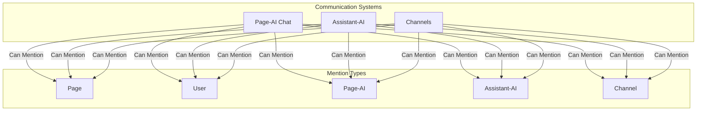

# AI Mentions Architecture & Permission System

## Overview

pagespace supports mentions across three main communication systems, each with different permission models and context injection capabilities. This document outlines the architecture, permission differences, and implementation approach for unified mention functionality.

## System Comparison

### Page-AI Chat (`AI_CHAT` pages)

**Purpose**: AI conversations tied to specific document pages
**Permission Model**: Requires EDIT access on the specific page
**Context Injection**: 
- Static page content (always available)
- Mentioned pages (with permission checking)
- Page-AI conversation history when mentioned from other contexts
**API Route**: `/api/ai/page-ai/chat/[pageId]`
**Storage**: `chat_messages` table linked to pageId
**Scope**: Single page focused

```typescript
// Permission check example
const accessLevel = await getUserAccessLevel(userId, pageId);
const requiredLevel = permissionPrecedence.indexOf(PermissionAction.EDIT);
if (userLevel < requiredLevel) {
  return new NextResponse("Forbidden: You need EDIT access", { status: 403 });
}
```

### Assistant-AI (Sidebar AI)

**Purpose**: Multi-document AI assistant for drive-wide conversations
**Permission Model**: Drive-level access + mention-specific permission checking
**Context Injection**:
- Current page context (from page being viewed)
- Dynamically mentioned pages (permission-filtered)
- Assistant conversation history when mentioned
**API Route**: `/api/ai/ai-assistant/chat`
**Storage**: `assistant_conversations` + `assistant_messages` tables
**Scope**: Drive-wide with selective page context

```typescript
// Permission check for mentions
const accessiblePagesMap = await getUserAccessiblePages(userId, mentionedPageIds);
const mentionedPagesContent = Array.from(accessiblePagesMap.values())
  .map(page => getPageContentForAI(page))
  .join('\n\n');
```

### Channels (`CHANNEL` pages)

**Purpose**: Human-to-human team communication
**Permission Model**: Standard page permissions (VIEW/EDIT)
**Context Injection**: Rich content with mentions, rendered as hyperlinks
**API Route**: `/api/channels/[pageId]/messages`
**Storage**: `channel_messages` table
**Scope**: Page-scoped team communication

## Mention Types & Data Structures

### 1. Page Mentions (@page-name)
```typescript
{
  type: 'page',
  id: string,           // Page ID
  label: string,        // Page title
  data: {
    pageType: 'DOCUMENT' | 'FOLDER' | 'DATABASE' | 'CHANNEL' | 'AI_CHAT',
    driveId: string
  }
}
```

**Context Injection (AI only)**:
- Full page content via `getPageContentForAI()`
- Permission checked via `getUserAccessiblePages()`

### 2. User Mentions (@username)
```typescript
{
  type: 'user',
  id: string,           // User ID
  label: string,        // Display name
  data: {
    email: string,
    avatar?: string
  }
}
```

**Context Injection**: None (user reference only)

### 3. Page-AI Mentions (@ai-chat-name)
```typescript
{
  type: 'page-ai',
  id: string,           // Page ID (AI_CHAT type)
  label: string,        // Chat page title
  data: {
    pageId: string,
    messageCount: number,
    lastActivity: Date,
    driveId: string
  }
}
```

**Context Injection (AI only)**:
- Full conversation history from `chat_messages` table
- Associated page content
- Permission checked via page access level

### 4. Assistant-AI Mentions (@assistant-conversation)
```typescript
{
  type: 'ai-assistant',
  id: string,           // Conversation ID
  label: string,        // Conversation title
  data: {
    conversationId: string,
    title: string,
    driveId: string,
    messageCount: number,
    lastActivity: Date
  }
}
```

**Context Injection (AI only)**:
- Conversation history from `assistant_messages` table
- Referenced page context from conversation
- Permission checked via drive access + mentioned pages

### 5. Channel Mentions (@channel-name)
```typescript
{
  type: 'channel',
  id: string,           // Page ID (CHANNEL type)
  label: string,        // Channel name
  data: {
    pageId: string,
    memberCount: number,
    driveId: string
  }
}
```

**Context Injection (AI only)**:
- Recent message history from `channel_messages` table
- Permission checked via page access level

## Permission Architecture

### Hierarchical Permission Levels
```typescript
const permissionPrecedence = ['VIEW', 'EDIT', 'SHARE', 'DELETE'];
// Higher index = more permissions (EDIT includes VIEW, etc.)
```

### Permission Checking Flow

1. **System Access**: User must have access to the chat system (page-ai, ai-assistant, or channel)
2. **Mention Search**: Only show entities user has permission to see
3. **Context Injection**: Verify permission before injecting mentioned content
4. **Render Permission**: Verify permission before rendering mention links

### Permission Matrix

| Mention Type | Search Permission | Context Injection Permission | Link Navigation |
|--------------|-------------------|------------------------------|-----------------|
| Page | VIEW on page | VIEW on page | Always allowed |
| User | Drive membership | N/A | Always allowed |
| Page-AI | VIEW on AI_CHAT page | VIEW on AI_CHAT page | EDIT required |
| Assistant-AI | Drive membership | Drive membership | Always allowed |
| Channel | VIEW on CHANNEL page | VIEW on CHANNEL page | Always allowed |

## Implementation Architecture

### Frontend Components

```
RichlineEditor
├── Enhanced Mention Node (with type/data)
├── Polymorphic MentionComponent
├── Unified Search Integration
└── Type-aware Suggestion Store
```

### Backend APIs

```
/api/mentions/search
├── Multi-type entity search
├── Permission filtering
├── Type-specific metadata
└── Drive/context scoping

/api/ai/*/chat (enhanced)
├── Type-aware mention processing
├── Context injection with permissions
└── Content security validation

/api/channels/[pageId]/messages
```

### Database Schema

**Enhanced**: Flexible mention tracking with type metadata

```sql
-- Enhanced mentions table (future consideration)
mentions_enhanced (
  id: string,
  source_type: 'page' | 'conversation' | 'message',
  source_id: string,
  target_type: 'page' | 'user' | 'page-ai' | 'ai-assistant' | 'channel',
  target_id: string,
  context_data: jsonb,
  created_at: timestamp
)
```

## Security Considerations

1. **Permission Verification**: All mention operations verify user permissions
2. **Content Sanitization**: AI context injection sanitizes content before use
3. **Access Logging**: Mention access can be tracked for audit purposes
4. **Rate Limiting**: Search endpoints implement rate limiting
5. **Context Boundaries**: AI systems respect content boundaries and permissions

## Implementation Status

The enhanced mention system has been fully implemented across all chat interfaces, including Page-AI, Assistant-AI, and Channels. The core features are complete and operational.

- **Unified Input**: All chat inputs now use the `RichlineEditor` component, providing a consistent user experience with rich text, mentions, and formatting.
- **Rich Content Rendering**: Messages are correctly rendered, ensuring that mentions and formatting are displayed properly.
- **Multi-Type Support**: The system supports mentions for pages, users, AI chats, AI assistant conversations, and channels.

This architecture provides a flexible, secure, and scalable mention system that respects the unique permission models of each communication system while enabling rich context sharing where appropriate.

