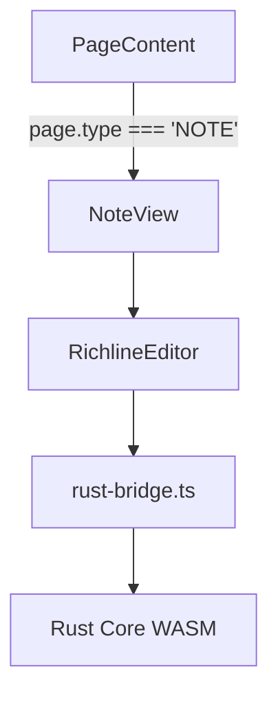

# Plan: Integrate Richline-Editor as 'NOTE' Page Type

This document outlines the plan to integrate the `richline-editor` as a new page type called 'NOTE'.

## 1. Summary

The goal is to create a new page type that uses the `richline-editor` for its view. This involves updating enums, creating a new view component, integrating the editor's React files, updating the database schema, and modifying the rendering logic.

## 2. Component Architecture

The following diagram illustrates the proposed component structure for the new page type.

## 3. Implementation Steps

-   [ ] **Define 'NOTE' page type in enums:**
    -   Add `'NOTE'` to `PageType` enum in `packages/lib/src/enums.ts`.
-   [ ] **Create NoteView component to wrap RichlineEditor:**
    -   Create a new directory `apps/web/src/components/layout/middle-content/page-views/note/`.
    -   Create `NoteView.tsx` inside the new directory. This component will wrap the `RichlineEditor` and pass the page data to it.
-   [ ] **Integrate RichlineEditor component files:**
    -   Copy the contents of `richline-editor/richline-react/src` to `apps/web/src/components/richline/`.
-   [ ] **Add 'NOTE' to the database schema:**
    -   Add `'NOTE'` to the `pageType` enum in `packages/db/src/schema/core.ts`.
-   [ ] **Update PageContent to render NoteView:**
    -   Import `NoteView`.
    -   Add a `case` for `PageType.NOTE` in the `switch` statement in `apps/web/src/components/layout/middle-content/index.tsx`.
-   [ ] **Generate and apply database migration:**
    -   Run the necessary commands to generate and apply a new database migration.
-   [ ] **Update documentation:**
    -   Update `docs/3.0-guides-and-tools/adding-page-type.md` and any other relevant documentation.
